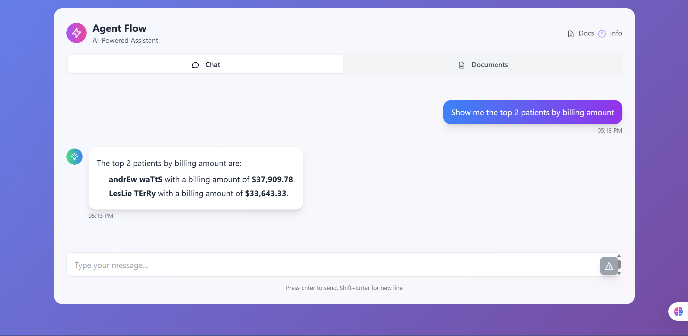

 
# Agent Flow

Agent Flow is a agent-based system built using the `uagents` framework. It combines document retrieval, SQL querying, and large language model reasoning to answer natural language questions. This system routes queries intelligently across different specialized agents to provide accurate, explainable, and context-aware responses.

[](https://youtu.be/b1CBpXBktng)

[Click to watch demo video for round 1](https://youtu.be/b1CBpXBktng)

[Click to watch demo video for round 2](https://www.youtube.com/watch?v=Op9RQ0L68u4)

[Final presentation link](https://agentflow.my.canva.site/)


## Overview

The system consists of several agents, each with a specific responsibility:

- Intent Classifier Agent: Determines the type of user query (SQL, document, hybrid, or unknown).
- SQL Agent: Translates natural language into SQL, executes it on a SQLite database (`project.db`), and summarizes the result.
- Document Agent: Performs similarity search across document embeddings to answer context-based questions.
- Hybrid Agent: Uses both similarity search and SQL execution for complex questions requiring multi-source reasoning.
- Error Handler Agent: Handles misclassified or ambiguous queries using LLM's general knowledge capabilities.
### Agent Workflow Chart


## Features

- Modular agent architecture using `uagents`.
- SQLite database (`project.db`) for structured supply chain data.
- LLM-powered SQL generation using ASI:ONE.
- Document-based similarity search for unstructured data.
- Hybrid reasoning that combines structured and unstructured data.
- Fallback logic for gracefully handling unknown or poorly classified queries.

## FastAPI Application Summary

The backend is built with **FastAPI** and provides a secure, modular interface for document upload, vectorization, querying, and admin-controlled operations. Key highlights include:

* **Document Upload & Processing**: Uploaded PDF documents are stored, chunked, and embedded using **Google Generative AI embeddings**. The chunks are indexed using **FAISS**, and stored in a local vector database directory for retrieval.
* **Document Management**: A `DocManager` class handles all operations related to uploading, retrieving, listing, and deleting document metadata and vectorstore directories.
* **Query Execution**: The `/query` endpoint writes natural language questions to a file (`query_to_agents.txt`) to be picked up by backend agents. Responses are read from `response_from_agents.txt` and returned to the user.
* **Authentication**: Admin authentication is enabled via a login form, generating a session token to restrict document operations.
* **SQLite Upload Support**: A separate endpoint allows uploading `.db` files for SQL-based agents to query against.
* **CORS & Static Hosting**: CORS is fully enabled for dev flexibility. Static Vue.js frontend files are served from the `/static` directory.

> **Frontend**: A lightweight **Vue.js** frontend is used, embedded directly via **Vue CDN** (`https://unpkg.com/vue@3`). This avoids build complexities and allows tight integration with the static file-based FastAPI hosting setup.

### FastAPI Workflow Chart


## Technologies Used

* **Python** – Core programming language for building the agent logic and backend.
* **uAgents** – Agent-based microservices framework for defining and managing autonomous agents.
* **Fetch AI ASI\:ONE API** – Used for advanced natural language understanding and SQL generation via large language models.
* **SQLite** – Lightweight relational database for storing structured data such as orders, customers, and products.
* **FAISS** – Facebook AI Similarity Search library for fast and efficient vector-based semantic retrieval over PDF documents.


## 🛰️ Agent Addresses (Innovation Lab)

This project is part of the **Fetch.ai Innovation Lab** and includes the following autonomous agents:

- **Main Agent (Intent Classifier Agent)**  
  `test-agent://agent1qv68xelknm87mqkw3v8czfw3fnujdwzra09x8m32ff43lwzeefe67h9d675`

- **Document Agent**  
  `test-agent://agent1qg4kpt4nmjckg9umkapx7v45mx8h02342mhn8g0aez5lzzx0mcj72a0ncfj`

- **Hybrid Agent**  
  `test-agent://agent1qf05xu5emqz3y7gemadh08ekxnxvs6g9kj0ha068n8y3mzh94sn7cwrwlc8`

- **SQL Agent**  
  `test-agent://agent1qw4z53dh3ttmdqku5q0xpqm6s25a0g69fsgh3lr440ak38stvfcy79fh2lk`

- **Worker Agent Address**  
  `test-agent://agent1qv68xelknm87mqkw3v8czfw3fnujdwzra09x8m32ff43lwzeefe67h9d675`

 

## Screenshots

### Answer from Agent Flow on ASI:ONE


### Chat Interface


### Admin Panel

#### Admin Login


#### Document Management


#### Document Upload


#### Database Upload


#### Database Connection Details


### AgentVerse Integration

#### AgentVerse Agent Details


#### AgentVerse Local Agents


#### AgentVerse Intent Agent Chat


#### AgentVerse Logs


### API Documentation

#### FastAPI Docs


#### Info Page


### System Logs


## Getting Started

### 1. Clone the Repository

```bash
git clone https://github.com/0rajnishk/AgentFlow.git
cd agent-flow
```

### 2. Set Environment Variables

Create a `.env` file or export the following environment variable:

```bash
export GOOGLE_API_KEY="your-ASI:ONE-api-key"
```

### 3. Install Dependencies

```bash
pip install -r requirements.txt
```

### 4. Run the System

Launch each agent independently or as a managed process depending on your architecture. Example:

```bash
python agents/sql_agent.py
python agents/hybrid_agent.py
python agents/document_agent.py
python agents/error_handler_agent.py
```

### update the address of each of the above agents in the intent_classifier.py file
```python
# Replace these with the actual addresses printed by each worker agent at startup
SQL_AGENT_ADDR = "agent1qw4z53dh3ttmdqku5q0xpqm6s25a0g69fsgh3lr440ak38stvfcy79fh2lk"
HYBRID_AGENT_ADDR = "agent1q0sh6f3n2r8azrs524chrn0e7h7p3qkm25v502jzczkrgjmtnhe972h2g64"
DOC_AGENT_ADDR = "agent1q2tpmsy506wtsdn0j7823s2vdm7f50l485azzc6z8lh2zk50cqwevn03e6q"
ERROR_AGENT_ADDR = "agent1q08hrn7j6t7ywmwdllrvl903t08sn4xd2ua2t4hy4kd6uxspqq0rgaudrpx"

```


```bash
python agents/intent_classifier_agent.py
```


# Run them main.py our FastAPI server
```bash
uvicorn main:app --host 127.0.0.1 --port 8000 --reload
```


## Example Query Flow

1. User asks: *"Show me the top 5 most expensive products."*
2. Intent Classifier routes to SQL Agent.
3. SQL Agent generates SQL using ASI:ONE, executes on `project.db`, and summarizes.
4. Response returned to the user through the intent classifier.
